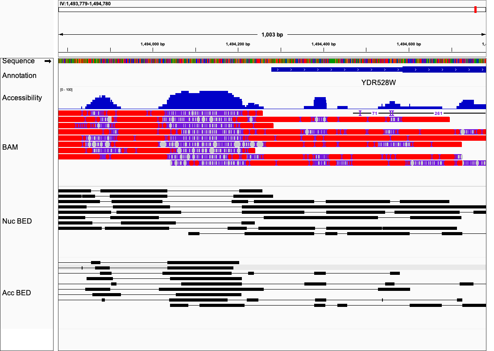

<h1 align="center">
  AdenineFootprinter
  <br>
</h1>

<p align="center">
  <a href="#key-features">Key Features</a> •
  <a href="#key-features">Key Features</a> •
  <a href="#how-to-use">How To Use</a> •
  <a href="#input-file-format">Input File Format</a> •  
  <a href="#output-file-format">Output File Format</a> •  
  <a href="#contact">Contact</a> 

</p>

## Example Output BAM File in IGV

> Detailed specifications in Output File Format
> BAM Output: Nucleosome regions are indicated as substitutions (red blocks), nucleosome regions, ambiguous regions
> are indicated as deletions and accessible regions are indicated as match regions (grey blocks). The methyladenosine 
> sites are indicated as insertion sites.
> BED Format: Each line represented one consensus read. The nucleosome regions and accessible regions are indicated as
> blocks within each line.

## Key Features

* Fast analysis of single-molecule nucleosome footprint using methylated adenine sites.
* Output BAM file ready for IGV viewer
* Optional BED file output for easy-to-analyze footprints and accessible regions.
* Improved accuracy for nucleosome footprinting using methylated adenine sites identified by PacBio Sequencing. 
* Improved accruacy for reads with wide per-read methylation fraction.
* Default model is optimized for M.EcoGII enzyme.
* Easy to train model from user-defined control samples.
* Perfect downstream Analysis for our methyloadenosine identification pipeline

## How To Use

To clone and run this application, you'll need [pysam](https://pysam.readthedocs.io/), [Biopython](https://biopython.org/), [numpy](https://numpy.org/doc/stable/index.html), [statsmodels](https://www.statsmodels.org/dev/user-guide.html)

```bash
# Clone this repository
$ git clone https://github.com/zhuweix/AdenineFootprinter.git

# Install dependencies using Conda
$ conda install numpy,scipy
$ conda install -c conda-forge statsmodels
$ conda install -c bioconda pysam,biopython

# Go into the repository
$ cd AdeineFootprinter

# build the package
$ python setup.py install
# Prepare the reference
# The reference file shuold be in fasta format
$ footprinter index \
  -r [reference.fa] \
  -o [reference_index.data]

# Analyze nucleosome footprint
# Using default model
$ footprinter predict \
  --bed [m6asites.bed] \
  --output [footprint.bam] 

# Export the single molecule footprint regions and accessible genome regions from the bam file
$ footprinter bamtobed \
    --bam [footprint.bam] \
    --footprint [footprint.bed]
    --accessible [accessible.bed]

# Generate the BedGraph format for nucleosome protection / accessibility
$ footprinter bedtobedgraph \
  --bed [footprint.bed | accessible.bed] \
  --output [Output.bed] \
  --name [NameOftheTrack] # Default=Fraction

[Optional]
# Train probability model using methylated gDNA control sample
$ footprinter train --bed [m6asites.bed] --window [window_size] --prefix [output_prefix]

# Analyze nucleosome footprint using user-control
$ footprinter predict --window [window_size] --model [output_prefix.json] --bed [m6asites.bed] --output [footprint.bam] 

[Example]
# This example analyzed nucleosome footprints in S.cerevisiae using example methylated adenine sites
# The example data is included in the ./example folder

# Prepare the reference
$ footprinter index -r ./example/sacCer3.fa -o ./example/sacCer3.adenine.data

# Analyze nucleosome footprint
$ footprinter predict --bed ./example/example_nuclei.bed --output ./example/example.footprint.bam

# Optional: train model from methylated gDNA  control
$ footprinter train --bed ./example/example_gDNA.bed --window 25 --fp 0.01 --ref ./example/sacCer3.adenine.data  --prefix ./example/model

# Optional: predict data using trained model
$ footprinter predict --window 25 --model ./example/model.json --bed ./example/example_nuclei.bed --output ./example/example.footprint.bam


```

> **Note**
> pysam package is currently not available in windows


## Input File Format

* Reference File
  
  - FASTA Format
* Single molecule methylated adenine sites
  -BED Format

    Standard BED format. The methyladenosine sites from the same consensus read is stored in one line. The chrom, chrom_start, chrom_end are the positions of the read aligned to the reference genome. The methyladenosine sites are labeled as 1-bp blocks.

```
 One example BED line of one read with 111 identified methyladenosine sites

 I       0       1380    m54242_190305_180854/56492177   0       .       0       1380    0       111     1,1,1,1,1,1,1,1,1,1,1,1,1,1,1,1,1,1,1,1,1,1,1,1,1,1,1,1,1,1,1,1,1,1,1,1,1,1,1,1,1,1,1,1,1,1,1,1,1,1,1,1,1,1,1,1,1,1,1,1,1,1,1,1,1,1,1,1,1,1,1,1,1,1,1,1,1,1,1,1,1,1,1,1,1,1,1,1,1,1,1,1,1,1,1,1,1,1,1,1,1,1,1,1,1,1,1,1,1,1,1      35,51,55,57,61,62,67,69,71,72,76,80,82,87,88,90,98,103,107,109,111,113,124,129,134,138,141,143,146,148,152,154,167,283,297,435,436,448,452,455,458,463,467,470,472,474,476,478,481,484,486,488,491,498,499,501,503,505,509,510,511,515,516,520,521,522,527,529,531,532,538,541,619,696,698,708,778,781,786,789,791,792,797,798,802,805,809,812,813,815,818,819,825,827,831,833,922,944,957,1003,1098,1110,1121,1145,1162,1218,1246,1250,1258,1263,1265

 ```

## Output File Format

* BAM Format

The result is stored in the CIGAR string. The methyladenosine sites are labeled as insertions; the nucleosome footprints are markded as substitutions; the ambiguous regions are marked indicated as deletions; the accessible regions are stored as matched regions.

* BED Format

Standard BED format. Each line stored The accessbile regions or nucleosome footprints are stored as blocks in the BED lines.


---
## Contact
> [David Clark Lab](https://www.nichd.nih.gov/research/atNICHD/Investigators/clark)
> 
> GitHub [@zhuweix](https://github.com/zhuweix)

